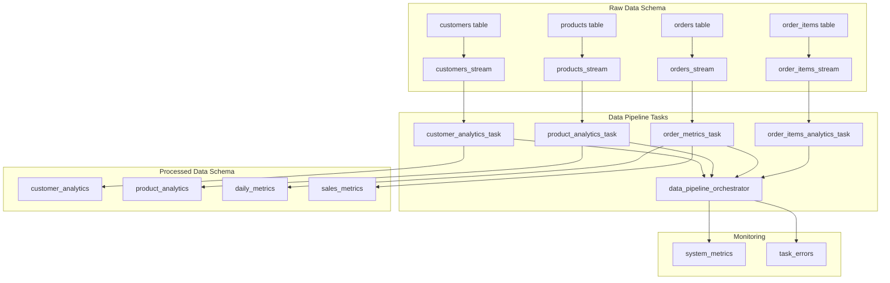

# 🚰 Data Pipeline Guide

## Overview

This data pipeline implements a modern ELT (Extract, Load, Transform) architecture using Snowflake streams and tasks to automatically move and transform data from the `raw_data` schema to the `processed_data` schema.

## Architecture



## Components

### 1. **Streams** (Change Data Capture)
Located in: `raw_data/data_pipeline_streams.sql`

- **customers_stream**: Captures changes to customer records
- **products_stream**: Captures changes to product records  
- **orders_stream**: Captures changes to order records
- **order_items_stream**: Captures changes to order item records

### 2. **Processing Stored Procedures**
Located in: `processed_data/data_pipeline_procedures.sql`

- **process_customer_changes()**: Transforms customer data into analytics
- **process_product_changes()**: Transforms product data into analytics
- **process_order_changes()**: Transforms order data into metrics

### 3. **Automated Tasks**
Located in: `raw_data/data_pipeline_tasks.sql`

- **customer_analytics_task**: Runs every 2 minutes when customer stream has data
- **product_analytics_task**: Runs every 2 minutes when product stream has data
- **order_metrics_task**: Runs every 1 minute when order stream has data
- **order_items_analytics_task**: Runs every 3 minutes when order items stream has data
- **data_pipeline_orchestrator**: Runs every 5 minutes to monitor pipeline health

### 4. **Management Tools**
Located in: `raw_data/data_pipeline_management.sql`

- Control procedures to start/stop pipeline
- Health monitoring views
- Testing and validation procedures

## Data Flow

### Customer Analytics Pipeline
```sql
Raw Customer Data → customers_stream → customer_analytics_task → customer_analytics table
```

**Transformations Applied:**
- Calculate total orders and spending per customer
- Determine customer status (Active/At Risk/Inactive)
- Predict lifetime value based on tier and history
- Calculate churn risk score
- Identify preferred product categories

### Product Analytics Pipeline
```sql
Raw Product Data → products_stream → product_analytics_task → product_analytics table
```

**Transformations Applied:**
- Calculate total quantity sold and revenue
- Compute profit margins and inventory turnover
- Analyze demand trends (Increasing/Decreasing/Stable)
- Apply seasonality factors
- Generate restocking recommendations

### Order Metrics Pipeline
```sql
Raw Order Data → orders_stream → order_metrics_task → daily_metrics + sales_metrics tables
```

**Transformations Applied:**
- Aggregate daily sales metrics
- Calculate customer acquisition metrics
- Identify top products and categories
- Generate monthly sales summaries
- Track order volume trends

## Usage

### Starting the Pipeline

```sql
-- Start all pipeline tasks
CALL start_data_pipeline();

-- Or start individual tasks
ALTER TASK customer_analytics_task RESUME;
ALTER TASK product_analytics_task RESUME;
ALTER TASK order_metrics_task RESUME;
ALTER TASK order_items_analytics_task RESUME;
ALTER TASK data_pipeline_orchestrator RESUME;
```

### Stopping the Pipeline

```sql
-- Stop all pipeline tasks
CALL stop_data_pipeline();

-- Or stop individual tasks
ALTER TASK customer_analytics_task SUSPEND;
-- ... etc
```

### Monitoring Pipeline Health

```sql
-- Check overall pipeline health
CALL check_data_pipeline_health();

-- View pipeline status
SELECT * FROM data_pipeline_status;

-- Check stream data availability
SELECT * FROM data_pipeline_streams;

-- Review execution history
SELECT * FROM data_pipeline_execution_history;

-- Analyze processing metrics
SELECT * FROM data_pipeline_metrics;
```

### Manual Processing

```sql
-- Force processing of all pending stream data
CALL force_pipeline_processing();

-- Process specific data types manually
CALL processed_data.process_customer_changes();
CALL processed_data.process_product_changes();
CALL processed_data.process_order_changes();
```

### Testing the Pipeline

```sql
-- Insert test data and verify stream capture
CALL test_data_pipeline();

-- Check if streams captured the test data
SELECT 
    'customers' as stream_name,
    SYSTEM$STREAM_HAS_DATA('customers_stream') as has_data
UNION ALL
SELECT 'products', SYSTEM$STREAM_HAS_DATA('products_stream')
UNION ALL  
SELECT 'orders', SYSTEM$STREAM_HAS_DATA('orders_stream')
UNION ALL
SELECT 'order_items', SYSTEM$STREAM_HAS_DATA('order_items_stream');
```

## Configuration

### Task Schedules

| Task | Schedule | Trigger |
|------|----------|---------|
| customer_analytics_task | 2 minutes | customers_stream has data |
| product_analytics_task | 2 minutes | products_stream has data |
| order_metrics_task | 1 minute | orders_stream has data |
| order_items_analytics_task | 3 minutes | order_items_stream has data |
| data_pipeline_orchestrator | 5 minutes | Always runs |

### Processing Logic

#### Customer Analytics
- **Customer Status**: Based on days since last order
  - Active: ≤ 30 days
  - At Risk: 31-90 days  
  - Inactive: > 90 days

- **Predicted LTV**: Based on customer tier
  - Enterprise: current spending × 1.5
  - Premium: current spending × 1.25
  - Standard: current spending × 1.1

- **Churn Risk Score**: Based on recency
  - > 180 days: 0.9 (high risk)
  - 91-180 days: 0.6 (medium risk)
  - 31-90 days: 0.3 (low risk)
  - ≤ 30 days: 0.1 (very low risk)

#### Product Analytics
- **Demand Trend**: Based on recent vs. historical sales
  - Increasing: recent > historical × 1.2
  - Decreasing: recent < historical × 0.8
  - Stable: between thresholds

- **Seasonality Factor**: Based on current month
  - Holiday season (Nov-Jan): 1.3
  - Summer (Jun-Aug): 1.1
  - Other months: 1.0

- **Recommendations**: Based on performance metrics
  - High revenue + low inventory → "Restock - High Performer"
  - Low revenue + high inventory → "Reduce Inventory"
  - Low margin → "Review Pricing"
  - Otherwise → "Monitor"

## Error Handling

### Automatic Error Resolution
The pipeline includes built-in error handling:

1. **Individual Task Errors**: Logged to `monitoring.task_errors`
2. **Pipeline Health Monitoring**: Orchestrator tracks overall health
3. **Automatic Cleanup**: Old errors auto-resolved to prevent alert fatigue
4. **Graceful Degradation**: Failed tasks don't stop other processing

### Manual Error Resolution

```sql
-- View recent errors
SELECT * FROM monitoring.task_errors 
WHERE error_timestamp >= DATEADD('hour', -24, CURRENT_TIMESTAMP())
AND resolved = FALSE
ORDER BY error_timestamp DESC;

-- Manually resolve errors
UPDATE monitoring.task_errors 
SET resolved = TRUE,
    resolution_notes = 'Manual resolution - issue fixed'
WHERE error_id = 'ERROR_ID_HERE';

-- Force retry failed processing
CALL force_pipeline_processing();
```

## Performance Optimization

### Stream Management
- Streams automatically advance after successful processing
- No manual stream management required
- Streams store change history for recovery

### Task Efficiency
- Tasks only run when streams have data (event-driven)
- Processing is incremental, not full table scans
- Parallel execution of independent tasks

### Resource Usage
- All tasks use the same warehouse (`analytics_wh`)
- Warehouse auto-suspends when not in use
- Processing scales with data volume

## Best Practices

### 1. **Monitoring**
- Regularly check `data_pipeline_status` view
- Monitor `system_metrics` for processing volumes
- Set up alerts for pipeline health degradation

### 2. **Maintenance**
- Review and resolve errors promptly
- Test pipeline after schema changes
- Monitor warehouse usage and adjust size if needed

### 3. **Development**
- Always test in development environment first
- Use `test_data_pipeline()` to validate changes
- Deploy pipeline changes through CI/CD

### 4. **Troubleshooting**
- Check stream status first: `SELECT * FROM data_pipeline_streams`
- Review task execution history for patterns
- Use `force_pipeline_processing()` for manual recovery

## Integration with CI/CD

The Jenkins pipeline automatically:
- Deploys stream and task changes when raw_data schema is modified
- Deploys processing procedures when processed_data schema is modified
- Maintains pipeline state across deployments
- Validates pipeline health after deployment

## Security

### Access Control
- All procedures and views have appropriate grants
- Tasks run with system privileges for cross-schema access
- Monitoring data is accessible to all authorized users

### Data Privacy
- No sensitive data logged in error messages
- Processing maintains data lineage
- Audit trail available through task execution history

---

**Next Steps**: After deployment, start the pipeline with `CALL start_data_pipeline()` and monitor its health using the provided management tools.