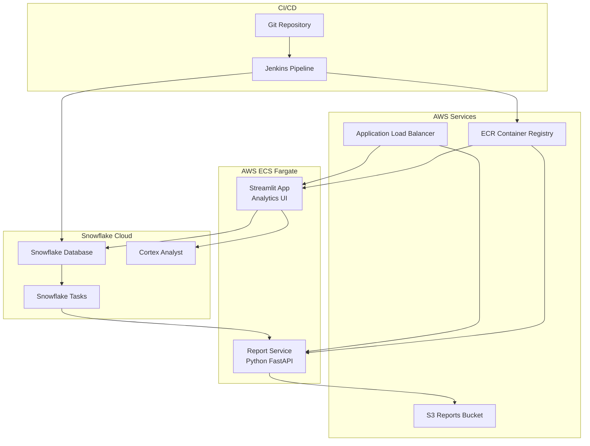

# ❄️ Snowflake Analytics Platform

A comprehensive, modern analytics platform built with Snowflake, featuring automated report generation, natural language querying via Cortex Analyst, and intelligent CI/CD deployment.

## 🏗️ Architecture Overview



## 🌟 Key Features

### Modern Engineering Principles
- **Single Branch Strategy**: All changes through main branch with CI/CD gates
- **Mono-repo Structure**: All components in single repository
- **Infrastructure as Code**: Database objects in version-controlled SQL
- **CREATE OR ALTER Pattern**: Idempotent deployments
- **Intelligent CI/CD**: Git diff-based deployment detection
- **Container-First**: All services containerized for ECS Fargate

### Snowflake Features
- **Cortex Analyst Integration**: Natural language to SQL conversion
- **Automated Task Triggers**: React to data changes in real-time
- **Modern Schema Design**: Organized by function with proper separation
- **Comprehensive Views**: Pre-built analytics and monitoring views
- **Data Quality Monitoring**: Automated checks and alerting

### Application Features
- **Modern UI**: Responsive design with dark/light themes
- **Real-time Analytics**: Live dashboard with key metrics
- **Natural Language Queries**: Ask questions in plain English
- **Automated Reports**: Background job processing with S3 storage
- **Multi-service Architecture**: Separated concerns for scalability

## 📁 Project Structure

```
SnowflakeSolutions/
├── sql/                              # Database schema and objects
│   ├── schemas/
│   │   ├── 00_database_and_warehouse.sql
│   │   ├── raw_data/                 # Source data tables
│   │   │   ├── tables.sql
│   │   │   ├── indexes.sql
│   │   │   ├── stored_procedures.sql
│   │   │   └── tasks_and_streams.sql
│   │   ├── processed_data/           # Analytics tables
│   │   ├── monitoring/               # System monitoring
│   │   └── reporting/                # Views and dashboards
│   ├── 02_sample_data.sql
│   └── deploy_order.md
├── python-report-service/            # Report generation API
│   ├── app.py
│   ├── pyproject.toml
│   └── Dockerfile
├── streamlit-app/                    # Analytics UI
│   ├── app.py
│   ├── pyproject.toml
│   ├── .streamlit/
│   └── Dockerfile
├── aws-infrastructure/               # ECS and infrastructure
│   ├── ecs-task-definitions/
│   ├── ecs-services/
│   └── docker-compose.yml
├── jenkins/                          # CI/CD pipeline
│   ├── Jenkinsfile
│   └── pipeline-examples.md
└── README.md
```

## 🚀 Quick Start

### Prerequisites

Ensure you have the following tools installed:

- [Terraform](https://terraform.io/) >= 1.0
- [AWS CLI](https://aws.amazon.com/cli/) configured with appropriate permissions
- [Docker](https://docker.com/) for building images
- [Make](https://www.gnu.org/software/make/) for automation (usually pre-installed on macOS/Linux)
- [jq](https://stedolan.github.io/jq/) for JSON processing

Check prerequisites:
```bash
make check-prerequisites
```

### First Time Setup

1. **Clone and Initialize**
   ```bash
   git clone <repository-url>
   cd SnowflakeSolutions
   make first-time-setup
   ```

2. **Configure Variables**
   ```bash
   # Edit terraform/terraform.tfvars with your settings
   vim terraform/terraform.tfvars
   ```

3. **Deploy Everything**
   ```bash
   # Deploy infrastructure, build images, and start services
   make up
   ```

4. **Get Service URLs**
   ```bash
   make get-urls
   ```

That's it! Your analytics platform is now running in AWS.

### 📋 Available Commands

#### Infrastructure Management
```bash
make init              # Initialize Terraform
make plan              # Show infrastructure changes
make deploy            # Deploy infrastructure only
make destroy           # Destroy all infrastructure
```

#### Service Management
```bash
make build-all         # Build and push all Docker images
make deploy-services   # Deploy services with current images
make start-services    # Start all services (scale to 1)
make stop-services     # Stop all services (scale to 0)
make restart-services  # Restart all services
```

#### Monitoring & Debugging
```bash
make status           # Show status of all services
make get-urls         # Get public URLs of services
make logs-report      # Show report service logs
make logs-streamlit   # Show Streamlit service logs
```

#### Quick Commands
```bash
make up               # Complete deployment (infrastructure + services)
make down             # Complete teardown
```

#### Local Development
```bash
make test-local       # Run services locally with Docker Compose
make test-local-down  # Stop local services
```

### 1. Database Setup

Deploy the Snowflake schema in order:

```bash
# Navigate to SQL directory
cd sql

# Deploy in the following order:
snowsql -f schemas/00_database_and_warehouse.sql
snowsql -f schemas/raw_data/tables.sql
snowsql -f schemas/raw_data/indexes.sql
snowsql -f schemas/raw_data/stored_procedures.sql
snowsql -f schemas/processed_data/tables.sql
snowsql -f schemas/monitoring/tables.sql
snowsql -f schemas/reporting/views.sql
snowsql -f schemas/permissions.sql

# Load sample data (development only)
snowsql -f 02_sample_data.sql
```

## 🛠️ Development Guide

### Adding New SQL Schemas

1. Create schema directory under `sql/schemas/`
2. Add SQL files following naming convention:
   ```
   your_schema/
   ├── tables.sql
   ├── indexes.sql
   ├── stored_procedures.sql
   └── views.sql
   ```
3. Update deployment order in pipeline
4. The pipeline will auto-detect changes and deploy only modified schemas

### Modifying Services

#### Report Service
```bash
cd python-report-service

# Install dependencies
uv venv && source .venv/bin/activate
uv pip install --dev .

# Run tests
uv run pytest

# Run locally
uv run uvicorn app:app --reload
```

#### Streamlit App
```bash
cd streamlit-app

# Install dependencies
uv venv && source .venv/bin/activate
uv pip install --dev .

# Run locally
uv run streamlit run app.py
```

### CI/CD Pipeline Usage

The Jenkins pipeline supports intelligent deployment:

```bash
# Deploy only changed components (recommended)
DEPLOYMENT_MODE: AUTO

# Deploy specific components
DEPLOYMENT_MODE: SQL_ONLY | REPORT_SERVICE_ONLY | STREAMLIT_APP_ONLY

# Force deploy everything
DEPLOYMENT_MODE: FORCE_ALL
```

## 📊 Usage Examples

### Natural Language Queries

The Streamlit app supports natural language queries via Cortex Analyst:

```
"Show me revenue trends for the last 6 months"
"Who are our top 10 customers by spending?"
"What's the current system health status?"
"Generate a sales report for last quarter"
```

### API Endpoints

Report Service API endpoints:

```bash
# Health check
GET /health

# Process job
POST /process-job
{
  "job_id": "JOB_123",
  "job_type": "REPORT",
  "input_data": {
    "report_type": "sales",
    "date_range": "last_month"
  }
}

# Get job status
GET /job/{job_id}/status

# Service metrics
GET /metrics
```

### Automated Job Processing

Jobs are automatically triggered when inserting into the jobs table:

```sql
-- Create a report generation job
CALL create_job(
    'Monthly Sales Report',
    'REPORT',
    'system',
    PARSE_JSON('{"report_type": "sales", "period": "monthly"}'),
    1  -- High priority
);

-- The Snowflake task will automatically:
-- 1. Detect the new job
-- 2. Call the Python service on ECS
-- 3. Generate report and upload to S3
-- 4. Update job status in Snowflake
```

## 🔧 Configuration

### Environment Variables

#### Report Service
```env
SNOWFLAKE_ACCOUNT=your-account
SNOWFLAKE_USER=your-user
SNOWFLAKE_PASSWORD=your-password
SNOWFLAKE_DATABASE=analytics_platform
SNOWFLAKE_WAREHOUSE=analytics_wh
AWS_REGION=us-east-1
S3_REPORTS_BUCKET=your-reports-bucket
```

#### Streamlit App
```env
SNOWFLAKE_ACCOUNT=your-account
SNOWFLAKE_USER=your-user
SNOWFLAKE_PASSWORD=your-password
SNOWFLAKE_DATABASE=analytics_platform
SNOWFLAKE_SCHEMA=reporting
```

### Snowflake Tasks

Enable automated processing:

```sql
-- Enable job processing task
ALTER TASK job_processor_task RESUME;

-- Enable cleanup task
ALTER TASK job_cleanup_task RESUME;

-- Enable daily metrics task
ALTER TASK daily_metrics_task RESUME;
```

## 📈 Monitoring & Observability

### Built-in Monitoring

- **System Health Dashboard**: Real-time status indicators
- **Job Monitoring**: Track all background jobs
- **Data Quality Checks**: Automated validation
- **Performance Metrics**: Execution times and success rates

### Key Metrics Views

```sql
-- System health
SELECT * FROM reporting.operational_status;

-- Job performance
SELECT * FROM reporting.job_monitoring;

-- Executive dashboard
SELECT * FROM reporting.executive_dashboard;

-- Customer analytics
SELECT * FROM reporting.customer_360;
```

### Alerts and Notifications

Configure Slack notifications in Jenkins pipeline:

```groovy
slackSend(
    channel: '#deployments',
    color: 'good',
    message: 'Deployment successful!'
)
```

## 🔒 Security

### Access Control
- **Role-based permissions** in Snowflake
- **AWS IAM roles** for ECS tasks
- **Secrets management** via AWS Secrets Manager
- **Network security** with VPC and security groups

### Best Practices
- No hardcoded credentials
- Encrypted data at rest and in transit
- Regular security scans in CI/CD pipeline
- Principle of least privilege

## 📚 API Documentation

### Report Service API

Full API documentation available at: `http://your-service-url/docs`

### Streamlit App Features

- **Semantic Model Selection**: Choose from different data models
- **Sample Queries**: Pre-built query examples
- **Auto-visualization**: Automatic chart generation
- **Export Capabilities**: Download results as CSV
- **Theme Support**: Light/dark mode toggle

## 🤝 Contributing

1. **Fork the repository**
2. **Create feature branch**: `git checkout -b feature/amazing-feature`
3. **Make changes** following coding standards
4. **Run tests**: `uv run pytest`
5. **Commit changes**: `git commit -m 'Add amazing feature'`
6. **Push to branch**: `git push origin feature/amazing-feature`
7. **Open Pull Request**

### Code Quality Standards

- **Python**: Follow PEP 8, use type hints
- **SQL**: Use consistent formatting and naming
- **Docker**: Multi-stage builds, non-root users
- **Tests**: Maintain >80% coverage

## 📄 License

This project is licensed under the MIT License - see the [LICENSE](LICENSE) file for details.

## 🆘 Support

### Common Issues

1. **Snowflake Connection Issues**
   - Verify account, user, and password
   - Check network connectivity
   - Ensure warehouse is running

2. **Container Build Failures**
   - Check Dockerfile syntax
   - Verify base image availability
   - Check UV dependencies

3. **ECS Deployment Issues**
   - Verify task definition configuration
   - Check security group settings
   - Ensure ECR permissions

### Getting Help

- **Documentation**: Check inline code comments
- **Issues**: Create GitHub issue with details
- **Pipeline**: See `jenkins/pipeline-examples.md`
- **SQL**: See `sql/deploy_order.md`

## 🎯 Roadmap

### Upcoming Features

- [ ] **Advanced Analytics**: Machine learning models with Snowpark
- [ ] **Real-time Streaming**: Kafka integration for live data
- [ ] **Multi-tenant Support**: Organization-based data separation
- [ ] **Advanced Visualizations**: Custom dashboard builder
- [ ] **Mobile App**: Native mobile analytics interface

### Performance Optimizations

- [ ] **Query Optimization**: Automated performance tuning
- [ ] **Caching Layer**: Redis for frequently accessed data
- [ ] **Auto-scaling**: Dynamic resource allocation
- [ ] **Cost Optimization**: Usage monitoring and recommendations

---

**Built with ❤️ using Snowflake, FastAPI, Streamlit, and modern DevOps practices.**