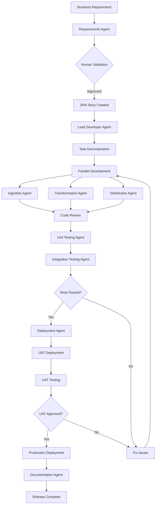
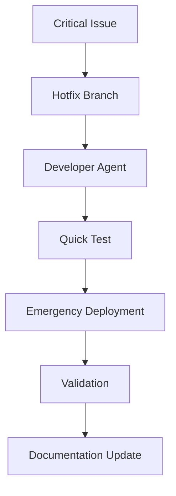

# AI Agents SDLC System Design & Requirements
## Financial Data Platform on Snowflake

---

## 1. Executive Summary

This document outlines the design and requirements for an AI-powered Software Development Life Cycle (SDLC) system for managing a Snowflake-based financial data platform. The system employs specialized AI agents to handle development, testing, deployment, and documentation tasks across the entire data pipeline lifecycle.

### 1.1 Project Overview
- **Platform**: Snowflake Data Lake & Data Warehouse
- **Domain**: Financial Investment Data
- **Data Categories**: Accounts, Customers, Funds/Schemes, Assets/Valuations, Transactions, Share Classes, Advisors
- **Ingestion Patterns**: Real-time, Near real-time, Micro-batch, Full batch
- **Use Cases**: BI reporting, Analytics, Data Science

---

## 2. System Architecture

### 2.1 High-Level Architecture

```
┌─────────────────────────────────────────────────────────────┐
│                    Human Stakeholders                        │
│                 (Product Owners, Architects)                 │
└────────────────────┬────────────────────────────────────────┘
                     │
┌────────────────────▼────────────────────────────────────────┐
│              AI Agent Orchestration Layer                    │
│                 (Central Coordinator)                        │
└─────────────────────────────────────────────────────────────┘
                     │
┌─────────────────────┴────────────────────────────────────────┐
│                        AI Agent Teams                         │
│  ┌──────────────┐  ┌──────────────┐  ┌──────────────┐      │
│  │ Requirements │  │ Development  │  │   Testing    │      │
│  │   Agents     │  │   Agents     │  │   Agents     │      │
│  └──────────────┘  └──────────────┘  └──────────────┘      │
│  ┌──────────────┐  ┌──────────────┐  ┌──────────────┐      │
│  │   DevOps     │  │Documentation │  │  Monitoring  │      │
│  │   Agents     │  │   Agents     │  │   Agents     │      │
│  └──────────────┘  └──────────────┘  └──────────────┘      │
└───────────────────────────────────────────────────────────────┘
                     │
┌────────────────────▼────────────────────────────────────────┐
│                  Snowflake Data Platform                     │
│  ┌────────────┐  ┌────────────┐  ┌────────────┐           │
│  │ Data Lake  │  │   Tasks    │  │Stored Procs│           │
│  └────────────┘  └────────────┘  └────────────┘           │
└─────────────────────────────────────────────────────────────┘
```

### 2.2 Data Flow Architecture

```
Data Sources → Ingestion Layer → Raw Data Lake → Transformation Layer → 
Curated Data Warehouse → Distribution Layer → BI/Analytics Consumers
```

---

## 3. AI Agent Specifications

### 3.1 Requirements Analysis Agent

**Purpose**: Transform business requirements into structured, actionable user stories

**Capabilities**:
- Natural language processing for requirement interpretation
- Requirement categorization and prioritization
- JIRA ticket creation and management
- Dependency identification
- Acceptance criteria generation

**Key Functions**:
```
- parseBusinessRequirement(text) → structured_requirement
- validateCompleteness(requirement) → validation_report
- generateUserStory(requirement) → jira_story
- identifyDependencies(requirement) → dependency_graph
- createAcceptanceCriteria(requirement) → test_criteria
```

**Integration Points**:
- JIRA REST API
- Confluence for documentation
- Slack/Teams for notifications

---

### 3.2 Development Agent Team

#### 3.2.1 Lead Developer Agent

**Purpose**: Coordinate development tasks and architectural decisions

**Capabilities**:
- Task decomposition and assignment
- Code review orchestration
- Technical design documentation
- Best practice enforcement

**Key Functions**:
```
- decomposeRequirement(story) → [ingestion_tasks, transformation_tasks, distribution_tasks]
- assignTasks(tasks, agent_pool) → task_assignments
- reviewCode(pull_request) → review_feedback
- generateTechnicalDesign(requirement) → design_document
```

#### 3.2.2 Ingestion Developer Agent

**Purpose**: Develop data ingestion pipelines

**Capabilities**:
- Source system integration
- Snowpipe configuration
- Stream/Task creation for real-time ingestion
- Error handling and retry logic
- Data validation at entry point

**Supported Patterns**:
- **Real-time**: Snowpipe, Kafka connectors
- **Near real-time**: Scheduled tasks (minute-level)
- **Micro-batch**: Hourly/15-minute loads
- **Full batch**: Daily/weekly/monthly loads

**Code Templates**:
```sql
-- Real-time ingestion via Snowpipe
CREATE PIPE {{pipe_name}}
  AUTO_INGEST = TRUE
  AS
  COPY INTO {{target_table}}
  FROM @{{stage_name}}
  FILE_FORMAT = {{format_name}}
  ON_ERROR = 'CONTINUE';

-- Near real-time task
CREATE TASK {{task_name}}
  WAREHOUSE = {{warehouse_name}}
  SCHEDULE = '1 MINUTE'
  AS
  CALL {{ingestion_procedure}}();
```

#### 3.2.3 Transformation Developer Agent

**Purpose**: Build data transformation logic

**Capabilities**:
- SQL/Stored procedure generation
- Data quality rule implementation
- Performance optimization
- Incremental processing logic

**Transformation Patterns**:
```sql
-- Standard transformation procedure template
CREATE OR REPLACE PROCEDURE transform_{{domain}}_data()
RETURNS VARCHAR
LANGUAGE SQL
AS
$$
BEGIN
  -- Step 1: Data validation
  CALL validate_source_data('{{source_table}}');
  
  -- Step 2: Apply business rules
  MERGE INTO {{target_table}} t
  USING (
    SELECT * FROM {{source_table}}
    WHERE {{business_conditions}}
  ) s
  ON t.{{key}} = s.{{key}}
  WHEN MATCHED THEN UPDATE SET ...
  WHEN NOT MATCHED THEN INSERT ...;
  
  -- Step 3: Update audit logs
  INSERT INTO audit_log ...;
  
  RETURN 'Transformation completed successfully';
END;
$$;
```

#### 3.2.4 Distribution Developer Agent

**Purpose**: Create data distribution and access layers

**Capabilities**:
- View/Materialized view creation
- Role-based access control setup
- API endpoint configuration
- Report dataset preparation

---

### 3.3 Testing Agent Team

#### 3.3.1 Unit Testing Agent

**Purpose**: Validate individual components

**Test Categories**:
- Data type validation
- Null/Empty value checks
- Business rule validation
- Referential integrity
- Performance benchmarks

**Test Framework**:
```sql
-- Unit test template
CREATE OR REPLACE PROCEDURE test_{{component_name}}()
RETURNS TABLE(test_name VARCHAR, status VARCHAR, details VARCHAR)
AS
$$
DECLARE
  test_results RESULTSET;
BEGIN
  -- Test 1: Data type validation
  test_results := (
    SELECT 
      'data_type_check' as test_name,
      CASE WHEN COUNT(*) = 0 THEN 'PASS' ELSE 'FAIL' END as status,
      COUNT(*) || ' records with invalid data types' as details
    FROM {{table_name}}
    WHERE NOT RLIKE({{column}}, '{{pattern}}')
  );
  
  RETURN TABLE(test_results);
END;
$$;
```

#### 3.3.2 Integration Testing Agent

**Purpose**: Validate end-to-end data flows

**Test Scenarios**:
- Source-to-target reconciliation
- Cross-system data consistency
- Workflow execution validation
- Performance testing
- Regression testing

---

### 3.4 DevOps Agent Team

#### 3.4.1 Deployment Agent

**Purpose**: Manage code deployment and environment promotion

**Capabilities**:
- Git integration for version control
- Environment configuration management
- Database object deployment
- Rollback capability
- Post-deployment validation

**Deployment Pipeline**:
```yaml
stages:
  - validate:
      - syntax_check
      - security_scan
      - dependency_check
  - deploy_dev:
      - create_objects
      - load_test_data
      - run_smoke_tests
  - deploy_uat:
      - backup_current_state
      - deploy_changes
      - run_regression_tests
  - deploy_prod:
      - approval_gate
      - deploy_with_monitoring
      - validate_deployment
      - publish_release_notes
```

#### 3.4.2 Monitoring Agent

**Purpose**: Track system health and performance

**Metrics Monitored**:
- Query performance
- Data freshness
- Error rates
- Resource utilization
- SLA compliance

---

### 3.5 Documentation Agent

**Purpose**: Maintain comprehensive system documentation

**Documentation Types**:
- Technical specifications
- Data dictionaries
- Process flows
- Release notes
- User guides
- API documentation

**Auto-generated Artifacts**:
```markdown
## Release Notes v{{version}}
### Date: {{date}}

#### New Features
- {{feature_list}}

#### Bug Fixes
- {{bug_fix_list}}

#### Performance Improvements
- {{performance_list}}

#### Database Changes
- Tables Added: {{new_tables}}
- Tables Modified: {{modified_tables}}
- Procedures/Tasks: {{procedure_list}}

#### Testing Summary
- Unit Tests Passed: {{unit_test_count}}
- Integration Tests Passed: {{integration_test_count}}
- Performance Baseline: {{performance_metrics}}
```

---

## 4. Data Domain Specifications

### 4.1 Account Domain
**Key Entities**:
- account_master
- account_holdings
- account_transactions
- account_valuations

**Update Frequency**: Real-time for transactions, daily for valuations

### 4.2 Customer Domain
**Key Entities**:
- customer_profile
- customer_preferences
- customer_kyc
- customer_risk_profile

**Update Frequency**: Near real-time for profile updates

### 4.3 Funds/Schemes Domain
**Key Entities**:
- fund_master
- fund_nav_history
- fund_performance
- fund_holdings

**Update Frequency**: Daily NAV updates, monthly holdings

### 4.4 Assets/Valuations Domain
**Key Entities**:
- asset_master
- asset_prices
- valuation_history
- market_data

**Update Frequency**: Real-time market data, EOD valuations

### 4.5 Transactions Domain
**Key Entities**:
- transaction_log
- settlement_details
- commission_details
- audit_trail

**Update Frequency**: Real-time processing

### 4.6 Share Classes Domain
**Key Entities**:
- share_class_master
- share_class_nav
- distribution_history
- fee_structure

**Update Frequency**: Daily updates

### 4.7 Advisors Domain
**Key Entities**:
- advisor_profile
- advisor_hierarchy
- advisor_commission
- advisor_performance

**Update Frequency**: Monthly updates

---

## 5. Workflow Orchestration

### 5.1 Standard Development Workflow



### 5.2 Emergency Fix Workflow



---

## 6. Integration Requirements

### 6.1 External Systems

| System | Integration Type | Purpose | Agent |
|--------|-----------------|---------|-------|
| JIRA | REST API | Ticket management | Requirements Agent |
| Git/GitLab | API/Webhooks | Version control | All Developer Agents |
| Snowflake | SQL/REST API | Database operations | All Agents |
| Slack/Teams | Webhooks | Notifications | Orchestrator |
| Confluence | REST API | Documentation | Documentation Agent |
| Jenkins/GitLab CI | API | CI/CD Pipeline | DevOps Agent |
| Datadog/Splunk | API | Monitoring | Monitoring Agent |

### 6.2 Security Requirements

**Authentication**:
- OAuth 2.0 for external APIs
- Service accounts for Snowflake
- MFA for production deployments

**Authorization**:
- Role-based access control (RBAC)
- Least privilege principle
- Segregation of duties

**Data Security**:
- Encryption at rest and in transit
- PII data masking
- Audit logging for all operations

---

## 7. Performance Requirements

### 7.1 Agent Response Times

| Agent Type | Max Response Time | Concurrency |
|------------|------------------|-------------|
| Requirements Analysis | 30 seconds | 10 requests |
| Development | 5 minutes | 20 tasks |
| Unit Testing | 2 minutes | 50 tests |
| Integration Testing | 10 minutes | 10 workflows |
| Deployment | 15 minutes | 3 deployments |
| Documentation | 1 minute | 100 requests |

### 7.2 Data Processing SLAs

| Data Type | Ingestion SLA | Transformation SLA | Availability |
|-----------|---------------|-------------------|--------------|
| Real-time | < 1 minute | < 2 minutes | 99.9% |
| Near real-time | < 5 minutes | < 10 minutes | 99.5% |
| Micro-batch | < 1 hour | < 2 hours | 99% |
| Full batch | < 4 hours | < 6 hours | 98% |

---

## 8. Monitoring and Alerting

### 8.1 Key Metrics

**System Health**:
- Agent availability and response times
- Queue depths and processing delays
- Error rates and types
- Resource utilization (CPU, memory, credits)

**Data Quality**:
- Record counts and completeness
- Data freshness indicators
- Validation rule pass rates
- Reconciliation mismatches

**Business Metrics**:
- Requirements throughput
- Development velocity
- Deployment frequency
- Mean time to recovery (MTTR)

### 8.2 Alert Configuration

| Alert Level | Condition | Action | Recipient |
|------------|-----------|---------|-----------|
| Critical | Production deployment failure | Immediate rollback | DevOps team |
| High | Data quality < 95% | Investigation required | Data team |
| Medium | Agent response > 2x normal | Performance review | Tech lead |
| Low | Documentation lag > 1 week | Update reminder | Documentation team |

---

## 9. Disaster Recovery

### 9.1 Backup Strategy
- **Code**: Git repository with daily backups
- **Data**: Snowflake Time Travel (7 days) + external backups
- **Configuration**: Version controlled in Git
- **Documentation**: Confluence with versioning

### 9.2 Recovery Procedures
- **RTO (Recovery Time Objective)**: 4 hours
- **RPO (Recovery Point Objective)**: 1 hour
- **Failover Process**: Automated with manual approval
- **Testing Frequency**: Quarterly DR drills

---

## 10. Implementation Roadmap

### Phase 1: Foundation (Months 1-2)
- Set up AI agent framework
- Implement Requirements Analysis Agent
- Basic JIRA integration
- Development environment setup

### Phase 2: Core Development (Months 3-4)
- Deploy Developer Agents (Ingestion, Transformation)
- Implement Unit Testing Agent
- Git integration
- Initial documentation templates

### Phase 3: Testing & Quality (Months 5-6)
- Integration Testing Agent
- Data quality framework
- Performance testing capabilities
- Enhanced error handling

### Phase 4: Automation & DevOps (Months 7-8)
- Deployment Agent with CI/CD
- Monitoring Agent
- Automated rollback capabilities
- Production readiness

### Phase 5: Optimization (Months 9-10)
- Performance tuning
- Advanced documentation generation
- ML-based requirement analysis
- Predictive monitoring

### Phase 6: Scale & Enhance (Months 11-12)
- Multi-environment support
- Advanced orchestration
- Self-healing capabilities
- Knowledge base integration

---

## 11. Success Metrics

### 11.1 Efficiency Metrics
- **Development Velocity**: 40% increase in story points delivered
- **Deployment Frequency**: From weekly to daily
- **Lead Time**: Requirement to production < 5 days
- **Automation Rate**: 80% of repetitive tasks automated

### 11.2 Quality Metrics
- **Defect Escape Rate**: < 5% to production
- **Test Coverage**: > 90% for critical paths
- **Data Quality Score**: > 98% accuracy
- **Documentation Completeness**: 100% for APIs and procedures

### 11.3 Business Impact
- **Time to Market**: 50% reduction
- **Operational Costs**: 30% reduction
- **System Availability**: 99.9% uptime
- **User Satisfaction**: > 4.5/5 rating

---

## 12. Risk Management

### 12.1 Technical Risks

| Risk | Probability | Impact | Mitigation |
|------|------------|--------|------------|
| AI hallucination in code generation | Medium | High | Human review gates, test validation |
| Integration failures | Low | High | Fallback mechanisms, manual override |
| Performance degradation | Medium | Medium | Resource monitoring, auto-scaling |
| Data quality issues | Medium | High | Validation rules, reconciliation checks |

### 12.2 Operational Risks

| Risk | Probability | Impact | Mitigation |
|------|------------|--------|------------|
| Knowledge loss | Low | High | Documentation, knowledge base |
| Dependency on AI | Medium | Medium | Manual procedures documented |
| Security breaches | Low | Critical | Security scanning, access controls |
| Compliance violations | Low | High | Audit trails, approval workflows |

---

## 13. Appendices

### Appendix A: Agent Communication Protocol

```json
{
  "message_type": "task_assignment",
  "from_agent": "lead_developer",
  "to_agent": "ingestion_developer",
  "timestamp": "2024-01-01T10:00:00Z",
  "payload": {
    "task_id": "TASK-001",
    "jira_id": "FIN-1234",
    "priority": "high",
    "deadline": "2024-01-02T18:00:00Z",
    "requirements": {
      "source": "kafka_topic",
      "target": "raw_transactions",
      "frequency": "real-time",
      "validation_rules": ["not_null", "referential_integrity"]
    }
  }
}
```

### Appendix B: Sample Snowflake Objects

```sql
-- Sample ingestion task
CREATE OR REPLACE TASK ingest_customer_data
  WAREHOUSE = COMPUTE_WH
  SCHEDULE = 'USING CRON 0 * * * * UTC'
  AS
  CALL sp_ingest_customer_updates();

-- Sample transformation procedure
CREATE OR REPLACE PROCEDURE sp_transform_transactions()
  RETURNS STRING
  LANGUAGE SQL
  AS
  $$
  DECLARE
    v_start_time TIMESTAMP_NTZ DEFAULT CURRENT_TIMESTAMP();
    v_row_count INTEGER;
  BEGIN
    -- Main transformation logic
    MERGE INTO dwh.fact_transactions t
    USING staging.raw_transactions s
    ON t.transaction_id = s.txn_id
    WHEN MATCHED AND s.updated_at > t.updated_at THEN
      UPDATE SET ...
    WHEN NOT MATCHED THEN
      INSERT ...;
    
    GET DIAGNOSTICS v_row_count = ROW_COUNT;
    
    -- Log execution
    INSERT INTO audit.job_log (job_name, start_time, end_time, rows_processed)
    VALUES ('sp_transform_transactions', v_start_time, CURRENT_TIMESTAMP(), v_row_count);
    
    RETURN 'Success: ' || v_row_count || ' rows processed';
  END;
  $$;
```

### Appendix C: Technology Stack

| Component | Technology | Version | Purpose |
|-----------|------------|---------|---------|
| AI Framework | LangChain/AutoGen | Latest | Agent orchestration |
| LLM | GPT-4/Claude | Latest | Code generation |
| Database | Snowflake | Enterprise | Data platform |
| Version Control | GitLab | Latest | Code repository |
| CI/CD | GitLab CI | Latest | Deployment pipeline |
| Project Management | JIRA | Cloud | Task tracking |
| Documentation | Confluence | Cloud | Knowledge base |
| Monitoring | Datadog | Latest | System monitoring |
| Communication | Slack | Latest | Team notifications |

---

## Document Version History

| Version | Date | Author | Changes |
|---------|------|--------|---------|
| 1.0 | 2024-01-01 | AI SDLC Team | Initial document |

---

*This document serves as the comprehensive guide for implementing the AI-powered SDLC system for the Snowflake financial data platform. Regular updates will be made as the system evolves and new requirements emerge.*