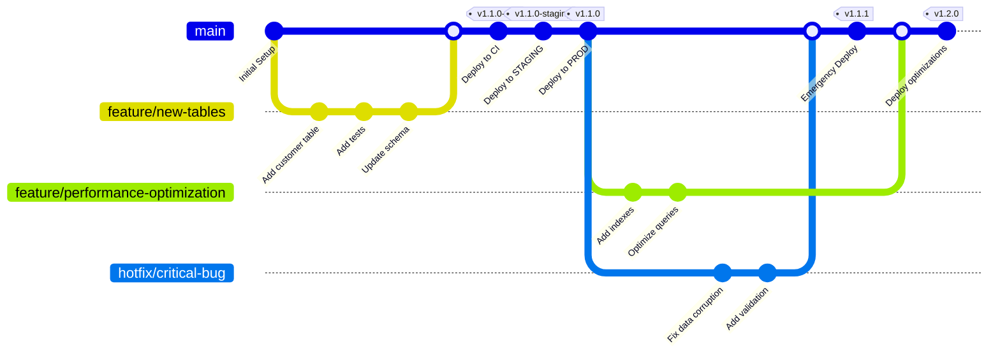
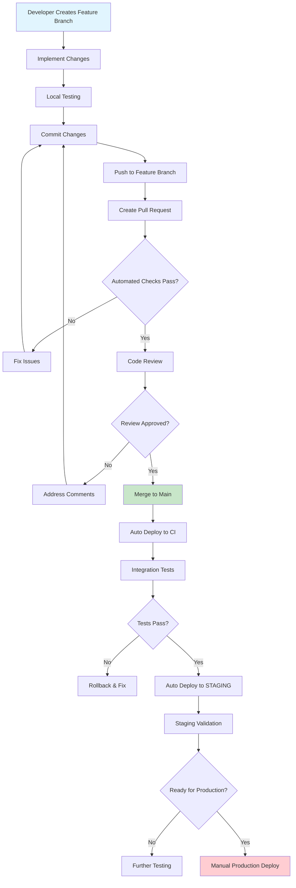
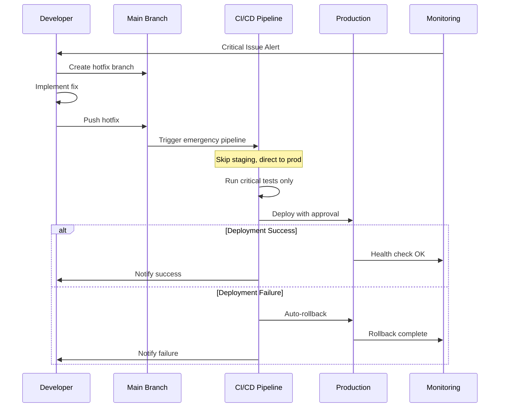
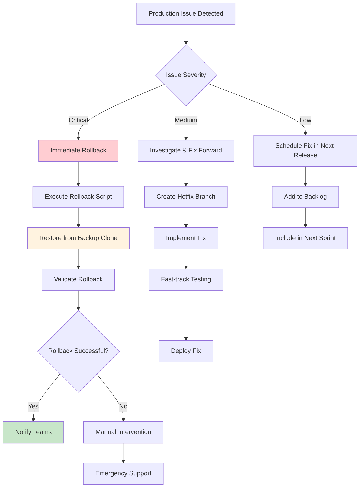
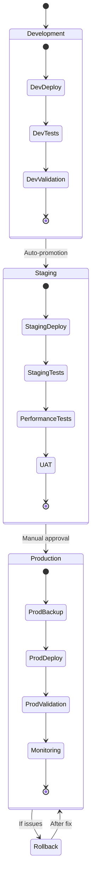
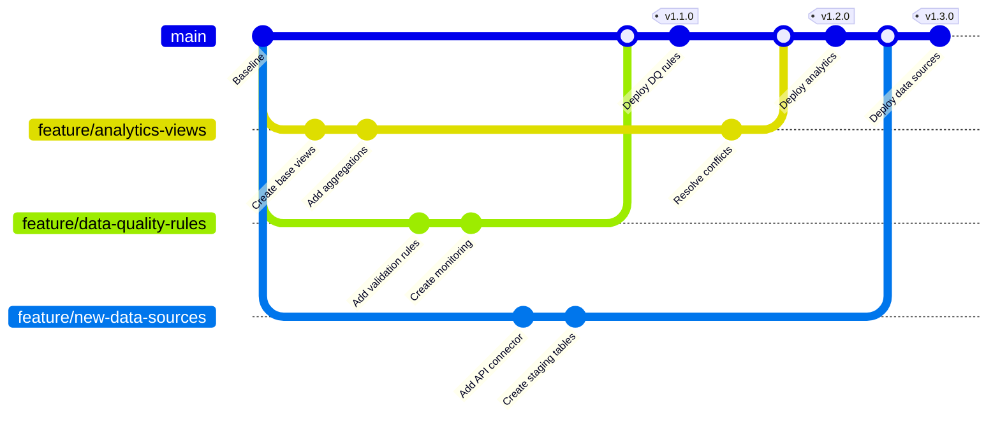
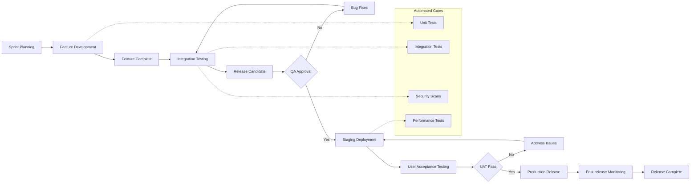
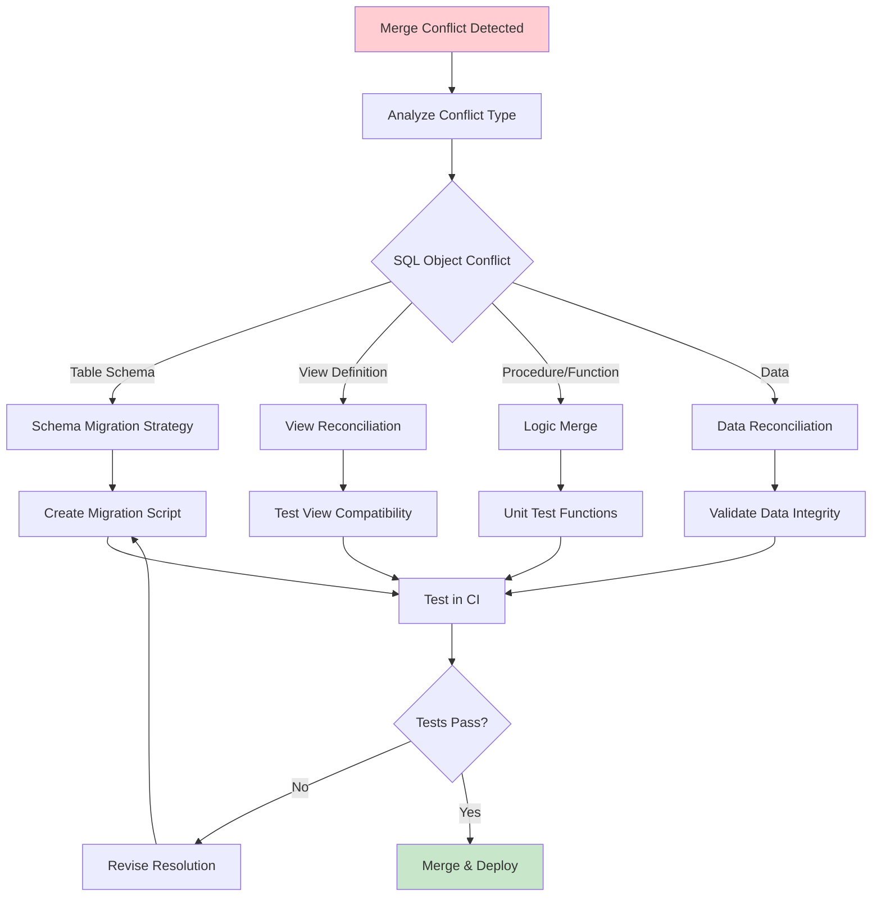
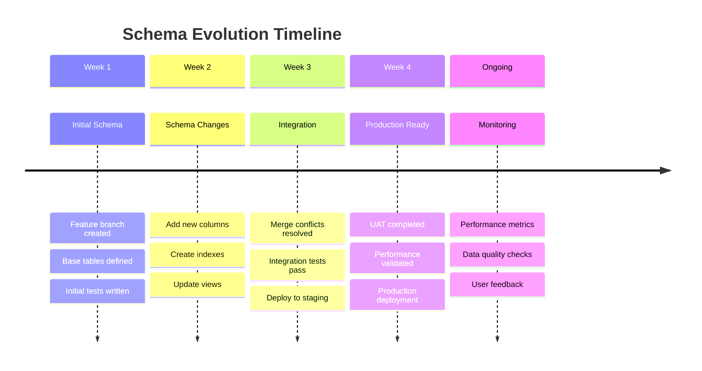
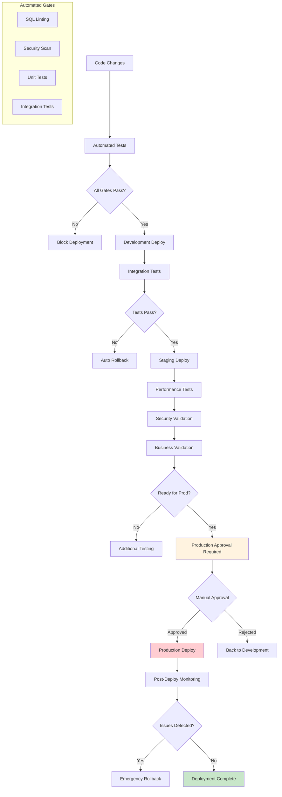

# Snowflake CI/CD Branching Strategy & Deployment Scenarios

## 1. Overall Branching Strategy



## 2. Feature Development Flow



## 3. Hotfix Emergency Process



## 4. Rollback Scenarios



## 5. Environment Promotion Flow



## 6. Parallel Feature Development



## 7. Release Management Process



## 8. Conflict Resolution Strategy



## 9. Database Schema Evolution



## 10. Deployment Gates & Approvals



## Branch Protection Rules

### Main Branch Protection
```yaml
# .github/branch_protection.yml
protection_rules:
  main:
    required_status_checks:
      - "ci/lint-and-validate"
      - "ci/unit-tests"
      - "ci/security-scan"
    enforce_admins: true
    required_pull_request_reviews:
      required_approving_review_count: 2
      dismiss_stale_reviews: true
      require_code_owner_reviews: true
    restrictions:
      users: []
      teams: ["data-engineering", "platform-team"]
```

## Workflow Summary

| Scenario | Branch Type | Approval Required | Auto-Deploy | Rollback Strategy |
|----------|-------------|-------------------|-------------|-------------------|
| Feature Development | `feature/*` | PR Review (2 approvers) | CI only | Branch deletion |
| Bug Fixes | `bugfix/*` | PR Review (1 approver) | CI + Staging | Standard rollback |
| Hotfixes | `hotfix/*` | Emergency approval | All environments | Immediate rollback |
| Releases | `main` | Production manager | CI + Staging | Database clone restore |
| Experiments | `experiment/*` | Data team lead | CI only | Environment reset |

## Key Principles

1. **Trunk-based Development**: Short-lived feature branches (max 3 days)
2. **Continuous Integration**: All changes tested automatically
3. **Progressive Deployment**: CI → Staging → Production
4. **Fast Rollback**: < 5 minutes to restore previous state
5. **Monitoring**: Real-time alerts for all environments
6. **Documentation**: All changes tracked and documented

This branching strategy ensures safe, reliable deployments while maintaining development velocity and supporting emergency scenarios.